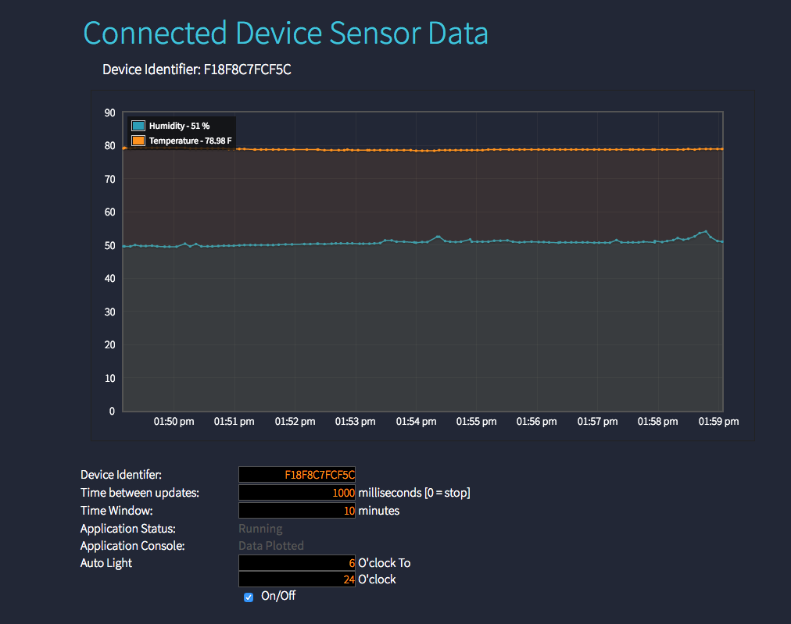

# Summary
This example shows how to create a basic Murano Solution Application that consists of a single web page that graphs sensor data for a specific device.

### Shows:
* Interacting with Solution API Routes from Web Page (HTML/Javascript)
* Deploying a simple (HTML,CSS,Javascript) single page web app
* Murano Service Routing
 * Time Series data - Routing product data into time series database and querying out for the graph
 * Key Value data - Routing product data into key/value storage

### Does Not Include
* Users / Auth - this is a simple public web page for development and education purposes only
* Device / Product code - Assumes data is being generated by a device in a Murano Product instance.  

### Assumptions
A device is sending data with resources `temperature` and `humidity` to your Product instance.

### To use:
1. Create a Solution - using this template 'https://github.com/exosite/murano-getting-started-solution-1/blob/master/Solutionfile.json' to populate the solution API Routes, Assets, and Service Set-up.

#### Notes:
1. WARNING: This is reference code, there are no guarantees.  It's easy to change the code and have it break.  Tip: Use source control when editing!
2. WARNING: Using code that refreshes often in browser windows carefully.  You can easily kill your browser.

### Timer Service API Code:

```lua
local identifier = "F18F8C7FCF5C"
local read = kv_read_opt(identifier, true)
local temperature = tonumber(read.temperature)

local title = "Exosite Swimming Pool Notification"
local message = "Wellcome Exosite Swimming Pool :D"

if temperature >= 80 then
  message = "Today's temperature is " .. temperature .. "F" .. ".\nIs really hot right?\nWhy don't you come Exosite to swim with us :D"
elseif 70 <= temperature and temperature < 80 then
  message = "Today's temperature is " .. temperature .. "F" .. ".\nIt's a good time to practice swimming~"
elseif temperature < 70 then
  message = "Today's temperature is " .. temperature .. "F" .. ".\nToday is cold so we have spa for you!"
end

Twilio.postMessage({
    From = "+16122551754",
    To = "+886xxxxxxxxx",
    Body = title .. "\n" .. message
})

Email.send({
  to = "yyyyyyyyy@exosite.com",
  subject = title,
  text = message
})

```

### Examples of what it looks like


